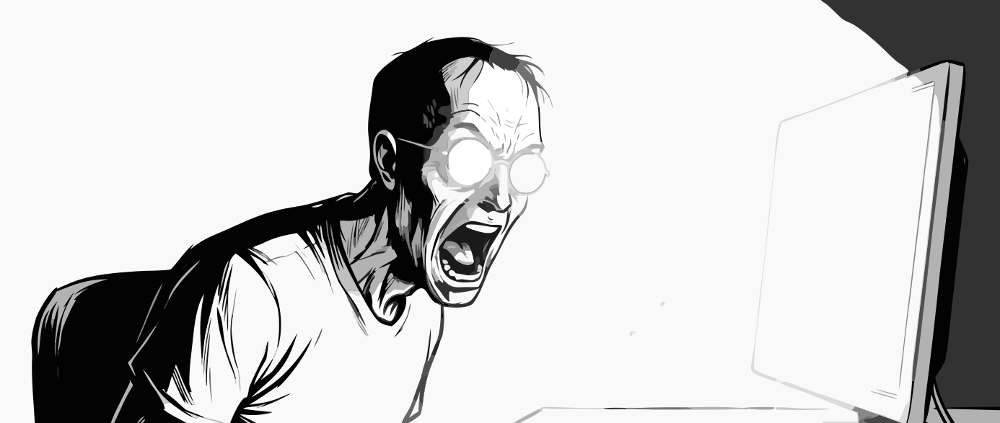

# MonBright

> A brightness slider for every monitor on your Apple Silicon Mac. By Kalyan.



## What this does

You know how your Mac has a brightness slider for its built-in screen, but your external monitors only have those tiny buttons on the back? MonBright fixes that. It puts a brightness slider in your menu bar — one for your laptop screen, and one for each external monitor you've plugged in.

Click the icon. Drag the slider. The screen gets brighter or darker. That's it.

```
┌──────────────────────────────────────┐
│  Built-in Liquid Retina XDR    70%   │
│  dim [=========o====] bright         │
│                                      │
│  MSI MD271UL                   48%   │
│  dim [======o=======] bright         │
│                                      │
│  ──────────────────────────────────  │
│  Brighten (hold fn)             F2   │
│  Dim (hold fn)                  F1   │
│  ──────────────────────────────────  │
│  Quit MonBright              Cmd+Q   │
└──────────────────────────────────────┘
```

You can also just tap **F1** to dim or **F2** to brighten — it'll change whichever screen your mouse cursor is on. No need to open the menu first.

## Will this work on my Mac?

You need two things:

1. **A Mac with an Apple chip** (M1, M2, M3, M4, or M5). To check: click the Apple logo  in the top-left of your screen → *About This Mac*. If the "Chip" line says *Apple M-something*, you're good. If it says *Intel*, this app won't work on your Mac.
2. **macOS Ventura or newer** (that's macOS 13, released in 2022). The same *About This Mac* window shows your version under "macOS". If yours says 13, 14, 15, or higher, you're good.

## How to install it

There are two ways. Pick whichever fits your situation.

### Easy way: Download MonBright.dmg

No coding needed. Just follow these steps in order.

**Step 1 — Download the DMG.**
Go to the [**Releases page**](https://github.com/kalyannarayanan/MonBright/releases/latest) and click **MonBright.dmg** under "Assets" to download it. The file is about 2 MB and lands in your Downloads folder.

**Step 2 — Open the DMG file.**
Double-click `MonBright.dmg` in your Downloads folder. A new window pops open showing the MonBright app next to a folder shortcut called *Applications*.

**Step 3 — Drag MonBright into Applications.**
Click and hold the MonBright icon, drag it onto the Applications shortcut, and let go. macOS copies the app into your Applications folder. You can now close the DMG window and eject the disk image.

**Step 4 — Open MonBright the first time.**
Open Finder, go to *Applications*, and double-click MonBright.

⚠️ **The first time only**, macOS will probably show a scary-looking warning that says something like:
> "MonBright" is damaged and can't be opened. You should move it to the Trash.

**Don't move it to the Trash.** The app isn't actually damaged — this warning shows up because the app wasn't bought from Apple's App Store. Here's how to get past it:

1. Open the **Terminal** app. (You can find Terminal in *Applications → Utilities*, or just press ⌘ + Space, type *Terminal*, and press Enter.)
2. Copy and paste this exact line into Terminal, then press Enter:
   ```
   xattr -dr com.apple.quarantine /Applications/MonBright.app
   ```
3. Close Terminal. Try opening MonBright from Applications again. This time it'll open with no warning.

**Step 5 — Find the icon in your menu bar.**
Look at the very top of your screen — the row of icons next to the clock, your Wi-Fi symbol, and your battery indicator. You should see a small monitor icon there. That's MonBright. Click it.

**Step 6 (optional) — Make it start automatically when you log in.**
If you want MonBright to launch every time you turn on your Mac:
- Open *System Settings* → *General* → *Login Items & Extensions*.
- Under *Open at Login*, click the **+** button.
- Find MonBright in your Applications folder and click *Open*.

You're done.

### Developer way: I want to build it from the source code

If you've installed developer tools before, this path skips the macOS warning entirely because the app is compiled directly on your machine.

```sh
git clone https://github.com/kalyannarayanan/MonBright.git
cd MonBright/macos
./build.sh && ./install.sh
```

If you don't already have Apple's developer tools, the `git` command will pop up a dialog offering to install them — just click *Install*. No admin password needed.

`install.sh` copies the app into your personal `~/Applications` folder and sets it to start at login. Nothing is written to system folders, so no admin password is ever needed.

## How to use it

- **Click the small monitor icon** in your menu bar (top of the screen). A panel drops down with one brightness slider per connected monitor.
- **Drag the slider.** That monitor's brightness changes live as you drag.
- **Quick brightness shortcuts:** Press **F2** to brighten or **F1** to dim whichever monitor your mouse is on, in 5% steps. Hold the key down to keep changing in a smooth ramp.
  - *On most Macs, you'll need to hold the fn key too* (so: `fn + F1` or `fn + F2`). That's because Apple uses F1 and F2 for the laptop's built-in brightness by default. If you'd rather just press F1 / F2 without fn, you can turn that on in *System Settings → Keyboard → "Use F1, F2 etc. as standard function keys"*.

Your settings are remembered for each monitor separately, so brightness levels stay put when you reboot, unplug a monitor, or plug it into a different cable port.

### Darker than your monitor's minimum

Turn an external monitor's own brightness all the way down and it's usually still brighter than you want at night. That's not a bug in the monitor — a monitor's "0" means *the dimmest its backlight goes*, not *off*, and on a typical panel that's still bright enough to read a white page by in a dark room.

The bottom third of MonBright's slider goes past that. Down there the monitor is already at its floor, so MonBright dims the picture itself instead, which gets you meaningfully darker than the buttons on the back of the monitor can. The tradeoff is that very dark shades start blending together, so use it when you want a dark screen rather than for color work.

A few details worth knowing:

- **It's invisible to screenshots and screen sharing.** Your screen looks dim to you, but a screenshot — or what your team sees when you share on a call — looks completely normal.
- **Quitting MonBright always undoes it.** The dimming lives in the running app, so if anything ever looks wrong, quitting restores your display immediately.
- **Some monitors only get the regular range.** If MonBright can't identify a monitor reliably (or you have several plugged in and one of them is ambiguous), that monitor gets the normal brightness range instead, with no dead spot in the slider.

## How to uninstall

**If you installed from the DMG:**
- Drag MonBright from your Applications folder into the Trash.
- If you set it to start at login (Step 5 above), open *System Settings → General → Login Items & Extensions* and remove it from the list.

**If you installed by building from source code:**
- In the project folder, run `./uninstall.sh`. That cleans everything up.

## Is this safe?

Yes. MonBright is built to require zero permissions.

- ❌ No Accessibility permission
- ❌ No Input Monitoring
- ❌ No Screen Recording
- ❌ No microphone or camera
- ❌ No internet / network access
- ❌ No access to your files, documents, mail, or photos
- ❌ No password or keychain access

MonBright never sees what you type, what's on your screen, or what's on your disk. It only adjusts the brightness of monitors you've already plugged in — using the same Apple display APIs that macOS itself uses for the brightness keys on your keyboard. For external monitors it sends DDC/CI commands over the display cable; for the built-in panel it calls `DisplayServicesSetBrightness`. The F1/F2 global hotkeys use Carbon's `RegisterEventHotKey`, so macOS itself intercepts those two specific keypresses and wakes the app — the app never sees any other keystroke, which is why no Accessibility or Input Monitoring permission is needed.

A few facts that may be useful for verification:

- **Network activity:** zero outbound connections. Visible in Activity Monitor's Network tab, or in any firewall tool (Little Snitch, LuLu) — the connection log will be empty.
- **File system writes:** only `/tmp/monbright.log`, a short diagnostic file written only when something fails.
- **Bundle identifier:** `local.user.MonBright`
- **Source code:** two Swift files, ~400 lines total, on GitHub.

---

<details>
<summary><b>For curious developers — how the brightness control actually works</b></summary>

macOS shows a brightness slider for the built-in display, but gives external monitors a read-only one (or none at all). The hardware *does* support brightness control — it speaks a protocol called **DDC/CI** over the USB-C / HDMI / DisplayPort cable. macOS just doesn't expose a UI for it.

MonBright uses two different paths depending on the display:

- **Built-in panel** → Apple's `DisplayServicesSetBrightness`, the same function the system uses for `fn+F1`/`fn+F2`.
- **External monitors** → DDC/CI: a tiny 6-byte I²C packet carrying VCP code `0x10` (Luminance) over the display cable, sent via `IOAVServiceWriteI2C`.

Brightness is saved per-monitor by EDID-derived ID, so it survives disconnects, reboots, and reconnects to a different port.

The same family of APIs is used by MonitorControl, Lunar, BetterDisplay, and m1ddc.

</details>

<details>
<summary><b>For curious developers — why the app contains two binaries</b></summary>

```
MonBright.app/Contents/MacOS/
├── MonBright   ← menu-bar UI (AppKit + SwiftUI)
└── setter      ← CLI helper that actually talks to the display
```

On Apple Silicon, when a Swift binary links AppKit, `IOServiceMatching("DCPAVServiceProxy")` returns external-monitor entries with an **empty property dictionary** — you can see the entry exists, but you can't read its `Location` or open its AV service. A plain CLI binary without AppKit gets the full view.

This is a known DCP-stack regression on macOS 14+ affecting ad-hoc-signed apps. Notarized GUI apps (MonitorControl, Lunar) sidestep it with a paid Developer ID. We don't have one, so the menu-bar app shells out to the `setter` CLI for each brightness write. Subprocess spawn is ~20 ms — invisible because the slider is already throttled to 20 Hz via Combine.

</details>

<details>
<summary><b>For curious developers — why the DMG needs that xattr command</b></summary>

The app is **ad-hoc signed** — a free, local-only signature. macOS Gatekeeper treats it the same as an unsigned binary. The instant the DMG is downloaded through a browser or AirDropped, macOS attaches a `com.apple.quarantine` flag to everything inside, and Gatekeeper refuses to open it with *"MonBright is damaged"* or *"developer cannot be verified."*

The `xattr -dr com.apple.quarantine ...` command strips that flag. After that, the app opens normally forever.

Why not notarize? Notarization needs a paid (\$99/year) Apple Developer ID, and Apple rejects binaries that link the private `DisplayServices` framework — which is exactly how we control the built-in display.

**Sharing this app:**

| Audience | Approach |
|---|---|
| Has Xcode CLT (or willing to install it) | Send them the repo URL — they run `./build.sh && ./install.sh`. No quarantine flag. |
| Doesn't have a compiler | You run `./package.sh`, send them `MonBright.dmg`, they drag-install + run the xattr command. |

</details>

<details>
<summary><b>For curious developers — files in this repo</b></summary>

| File | Purpose |
|------|---------|
| `main.swift` | Menu-bar app: `NSStatusItem` + SwiftUI sliders, Combine throttle, Carbon hotkeys |
| `setter.swift` | CLI helper: enumerates displays + parses EDID, writes brightness |
| `build.sh` | Compiles both binaries, builds the `.app`, ad-hoc codesigns, generates and embeds the app icon |
| `install.sh` | Copies to `~/Applications/`, registers a `launchd` agent for login auto-start |
| `uninstall.sh` | Removes the LaunchAgent and the installed copy |
| `package.sh` | Builds `MonBright.dmg` via `hdiutil` for sharing |
| `assets/icon.png` | 1024×1024 source for the app icon |
| `assets/build-icon.sh` | Generates `MonBright.icns` from `icon.png` |
| `assets/hero.svg` | The hero illustration above |

Diagnostic log: `/tmp/monbright.log` (only written on failures).

</details>

## Support

If MonBright saves you from squinting at your monitor every day, you can buy me a coffee. Totally optional — the app stays free either way.

[](https://buymeacoffee.com/kalyannarayanan)

## License

See [LICENSE](LICENSE).
